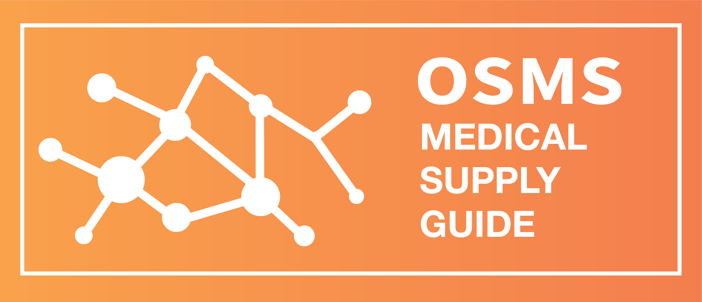

# Welcome

**OSMS SITE UNDER CONSTRUCTION**: 4/4/2020 Site update. The OSMS team is responding to requests from around the globe for machine-accessible versions of our documentation, including manufacturing spec sheets. To meet this need, we are transitioning our public website to a new platform over the coming seven days. Please join our [Facebook Group](https://www.facebook.com/groups/opensourcecovid19medicalsupplies/) for updates and view our latest guides below—OSMS 🌐

## Open Source Medical Supplies, "OSMS"

Created in response to the COVID-19 pandemic, Open Source Medical Supplies provides medically vetted, open-source plans and support in organizing local value chains for disaster response, so local makers and institutions can create and distribute much needed protective gear and equipment to local communities.

## Our Guides

Principle resources that OSMS provides are our "COVID-19 Medical Supply Guide", and our "COVID-19 Local Response Guide". The **Medical Supply Guide** is a guide to the utility, availability, and manufacturability of Medical Supplies, collaboratively created through the efforts of the OSMS team, researched by a team of medical advisers, and sourced from our 50,000-member Facebook Group. The **Local Response Guide** is a collection of best practices and specific instructions for volunteers dedicated to creating an impact in their local community in the OSMS network. 

[Open Source Medical Supply Guide](https://docs.google.com/document/d/1-71FJTmI1Q1kjSDLP0EegMERjg_0kk_7UfaRE4r66Mg/edit?usp=sharing) [v 1.2 updated 4/1/2020]

[OSMS Local Response Guide](https://oscms.box.com/s/zh0aynd8hflxkfdaucs14ifs05z8d8dn) [v 1.0 updated 3/26/2020]

## Join our facebook group!

Interested in getting involved? Please join our official OSMS COVID-19 Facebook Group, here:

[https://www.facebook.com/groups/opensourcecovid19medicalsupplies/](https://www.facebook.com/groups/opensourcecovid19medicalsupplies/)

## Find a local chapter

[OSMS Local Chapters Spreadsheet](https://docs.google.com/spreadsheets/d/1JH5uL3WW6PwvwFRe4wqXkheK0-jcGYqaPmb9J3Dr6Ac/edit?usp=sharing)

## About Us

**[Open Source Medical Supplies](https://opensourcemedicalsupplies.org/)** (OSMS) was formed to research, medically review, and disseminate open source plans for medical supplies used to treat and reduce the spread of COVID-19 that can be fabricated locally. Additionally, Open Source Medical Supplies supports, mentors and guides local communities as they self-organize hospital systems, essential services, professional fabricators, makerspaces, and local governments into resilient, self-supporting supply units.

In its first two weeks of operation, Open Source Medical Supplies helped organize 62,000 people all over the world in its Facebook group, supplied plans that volunteers turned into 280,000 medical supply items all over the world, produced an 80+ page long Open Source COVID-19 Medical Supply Guide, and released a COVID-19 Local Response Guide that helped local organizers form 95 local chapters all over the world.

Open Source Medical Supplies teamed up with RESOLVE, Schmidt Futures, Toyota Research Institute, and private donors to stand up a full-time team to help lead a global, distributed manufacturing response to COVID-19. OSMS collaborates with hospitals, non-profit institutions, governments, professional fabricators and makerspaces all over the world to help direct local fabrication response.

## Our Supporters

OSMS is powered by our partners. Special thanks to **SCHMIDT FUTURES** and **TOYOTA RESEARCH INSTITUTE** for funding support and  RESOLVE for their institutional support. For more information, visit our page on RESOLVE's website, here:

[https://www.resolve.ngo/osms.htm](https://www.resolve.ngo/osms.htm)

## Press

- "**[D.I.Y. Coronavirus Solutions Are Gaining Steam.](https://www.nytimes.com/2020/03/31/science/coronavirus-masks-equipment-crowdsource.html?smid=fb-nytimes&smtyp=cur&fbclid=IwAR3Ewi5b7aSykbmldrGcp_ppp5VNfuVkX2XU5dEsWIwFdqgnfzn1_r3q6c4)**" *New York Times*, March 31, 2020.
- "'**[This Is Truly a Last Resort.' Makers are 3D Printing Ventilator Parts and Sewing Masks Amid a Critical Shortage in Medical Supplies.](https://time.com/5811091/makers-3d-printing-coronavirus/?utm_source=facebook.com&utm_medium=social&utm_campaign=social-share-article&utm_content=20200401&fbclid=IwAR2j5RayRscZSgsvIZHkZxetjtiAwWz7Yd7ctSjNqWQn7dvddTRLP3IBm6Y)**" *Time*, April 1, 2020.
- "**[Robotics engineer crowd-sources designs for COVID-19 medical supplies to help out-of-stock hospitals.](https://www.cbc.ca/radio/day6/futures-on-hold-3d-printed-medical-gear-rem-s-mike-mills-choir-choir-choir-the-story-of-purell-and-more-1.5502663/robotics-engineer-crowd-sources-designs-for-covid-19-medical-supplies-to-help-out-of-stock-hospitals-1.5502671)**" *CBC*, March 20, 2020.
- "**[The Futuristic Solutions The Internet Is Crowdsourcing To Cure Coronavirus.](https://www.newsweek.com/crowdsourcing-solutions-coronavirus-covid-19-facebook-1493075?fbclid=IwAR0zFFUr2BaWnJ4AxtIAgoLxxZ3rUWiqcPmMmptB5up3Sv_lhaj8LFD3E8o)**" *Newsweek*, March 18, 2020.

Copyright 2020, **Open Source Medical Supplies**. [opensourcemedicalsupplies.org](http://opensourcemedicalsupplies.org)